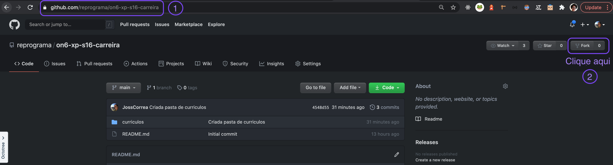
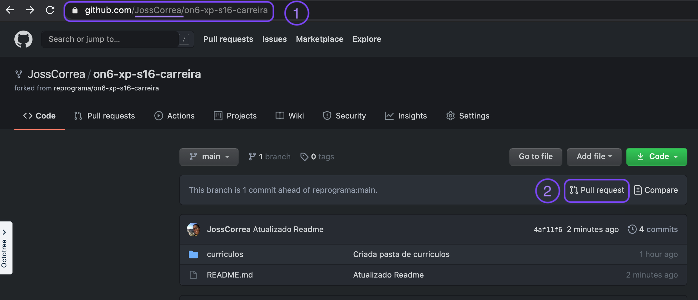
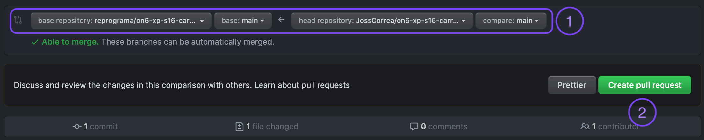

# ON6 XP - Carreira

Nessa semana vamos olhar um pouquinho para nossa trajetória e preparar aquele currículo amorzinho. 💜

## 📝 Dicas importantes:
- Seja objetiva
- Não faça uma cópia exata do texto do Linkedin (já vai ter link do seu linkedin no currículo)
- Tenha orgulho da sua bagagem
- Peça ajuda das amigas

## 🤷🏾‍♀️ Mas como eu vou enviar o currículo ?
1. Forkar o respositório fonte (https://github.com/reprograma/on6-xp-s16-carreira)

  

2. Clonar o repositório criando no **seu github** para sua máquina (⚠️ não é o repositório da reprograma, é o fork no seu github)
  ``` bash
    $ git clone [url-do-repositorio-forkado-no-seu-github]
  ```

3. Na pasta currículos, abrir o arquivo com seu nome, alterar as informações necessárias e salvar o arquivo. Cuidado pra não mexer no arquivo da colega 😉

4. Quando finalizar as alterações no seu currículo, lembre de adicionar e fazer o commit
  ``` bash
    $ git add [nome-do-arquivo-modificado]
    $ git commit -m "mensagem-sobre-o-que-foi-feito"
  ```
5. Subir suas alterações para seu repositório (na branch main mesmo): 
  ``` bash
    $ git push
  ```

6. Entre no seu github e selecione a opção pull request. No endereço deve estar o nome do seu usuário no github no lugar de JossCorrea

 

7. Após executar a etapa anterior vai abrir uma janela para você abrir o pull request. Verifique se as informações estão corretas e clique em Create Pull Request.

  

8. Escreve uma mensagem no PR e clique em Create Pull Request (⚠️ não clique em merge, deixe que a equipe da reprograma vai fazer isso)
 [Fork](assets/pr2.png)
